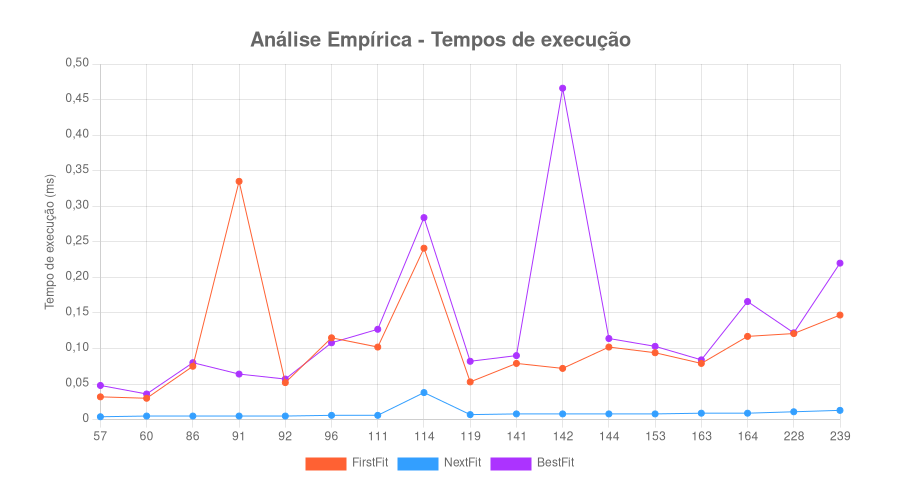

# Análise de Algoritmos - Projeto 3
### BIN-PACKING-OPTM e algoritmos aproximados

Este projeto tem como objetivo principal comparar o tempo de complexidade das soluções de aproximação para o problema de binpacking, utilizando os métodos First-Fit, Next-Fit e Best-Fit.


## Instruções de uso
Para executar o programa, clone o projeto localmente e, no terminal, digite os seguintes comandos:

```
npm install;

node index.js;
```

## Exemplo de gráfico de tempo de execução


## Exemplo de tabela de assertivadade para cada método

